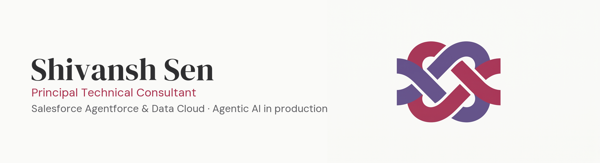

  
  
  

Four years inside enterprise Salesforce platforms — CPQ, Revenue Cloud, integrations — before moving into building AI agent systems on top of that same data.

- 🤖 Building agentic AI systems on Salesforce Agentforce & Data Cloud — real deployments, not demos
- 🧭 Deciding what an agent can do alone, and where a person has to stay in the loop
- 🛠️ Shipping with Claude Code and Codex, across AWS and GCP

### Stack

  
  
  
  
  
  
  

Full portfolio, case studies, and writing: **[shivanshsen.com](https://shivanshsen.com)**
