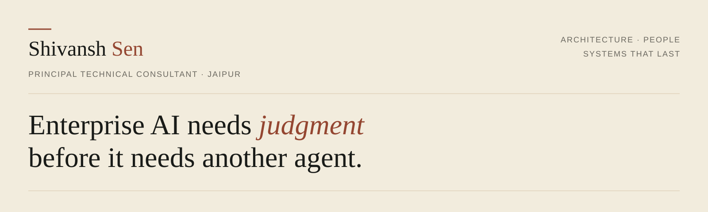

I'm Shivansh, a Principal Technical Consultant in Jaipur. I design governed agent systems, Salesforce architectures, and the human approval paths between them.

Five years building enterprise Salesforce platforms: CPQ, Revenue Cloud, and integrations. My work now includes Agentforce, Data Cloud, and deciding what an agent can do alone.

**18× Salesforce Certified** · [Trailblazer](https://www.salesforce.com/trailblazer/shivanshsen7)

[Decision notes](https://shivanshsen.com/decision-notes) · [Systems shipped](https://shivanshsen.com/systems) · [About me](https://shivanshsen.com/about)

 

### Selected work

- **[Salesforce Renames](https://github.com/shivanshsen7/salesforce-renames)** — An agent-queryable knowledge bundle tracking product and certification changes. Sources, verification status, and disputed claims stay visible.
- **[Codex SEO](https://github.com/shivanshsen7/codex-seo)** — An early TypeScript foundation for SEO workflows with reviewable evidence and explicit failure states. Not yet an installable toolkit.
- **[Nebula Logger docs with Blume](https://github.com/shivanshsen7/blume-nebula-logger-docs)** — My unofficial documentation rebuild of [jongpie's Nebula Logger](https://github.com/jongpie/NebulaLogger), with upstream attribution.

### Writing

**[Claude Code in Action: a practitioner's take](https://shivanshsen.com/decision-notes/claude-code-in-action-course-review)** 
What changed how I work after Anthropic's course, where I disagree, and the gaps you'll fill yourself.

I write about the decisions, tradeoffs, and false starts behind the build at **[Architecture Ledger](https://shivanshsen.com)**.

### Tools I use

Salesforce · Agentforce · Data Cloud · TypeScript · Python · AWS · GCP 
Claude Code · Codex

---

[Get in touch](https://shivanshsen.com/contact) · [LinkedIn](https://www.linkedin.com/in/shivanshsen7/)
